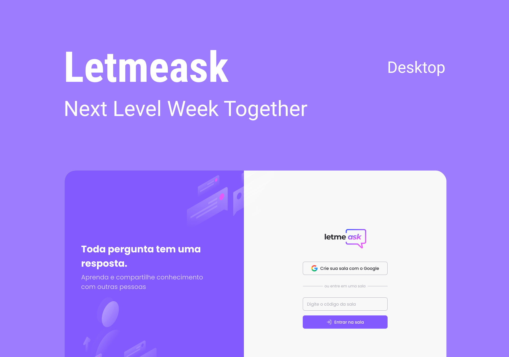

<h1 align="center">
  
</h1>

<b>Tecnologias</b> 

React 
Firebase 
TypeScript 

Para usar basta baixar a pasta raiz e suas dependencias, depois yarn start para iniciar 

<B>Projeto</b> 

o projeto consiste em criar salas Q&A 

Este é um projeto desenvolvido durante a Next Level Week Together 
